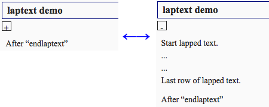

# jekyll_laptext
This Jekyll plugin adds `` tag.

When lapped texts are hidden, you can see "+" button. "+" button is clicked then lapped texts open.  
When lapped texts are open, you can see "-" button. "-" button is clicked then lapped texts hide.

This tag uses only html and css, dosen't use javascript.

## usage
First, put lapText.rb on your `_plugins` folder. Put laptext.css on your project folder, and load on header of html file.  
Of course, you can rewrite laptext.css.

### Liquid Tag
```

lapped texts

```

"id" is integer.  
If you want to use this tag twice and more, you should assign other "id".

"open" is 'open' or 'close' or not set.  
If you assign 'open', lapped texts are open when the page is created. 

## image

```
## laptext demo

Start lapped text.  
...  
...  
Last row of lapped text.


After "endlaptext"
```
